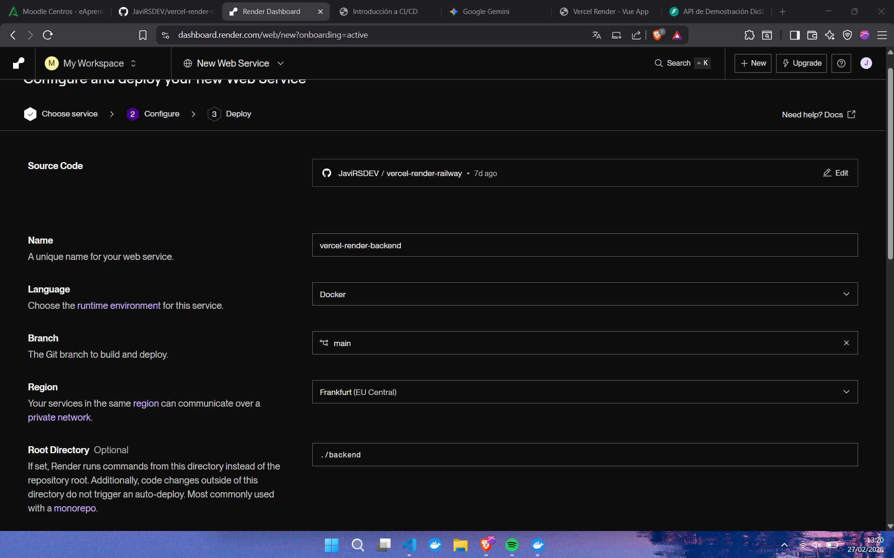
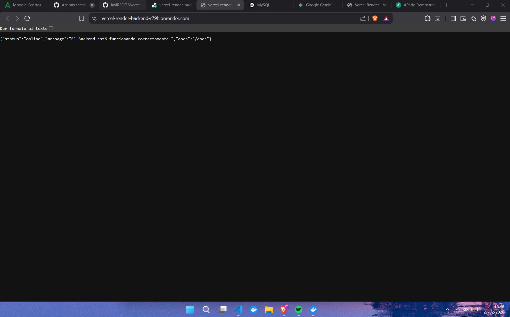
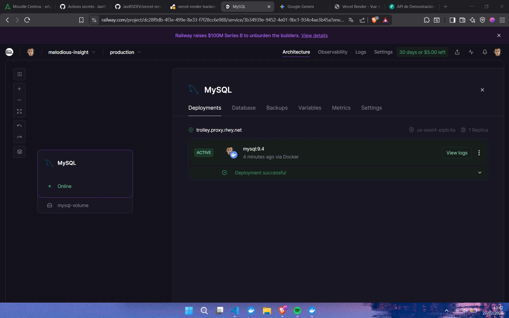
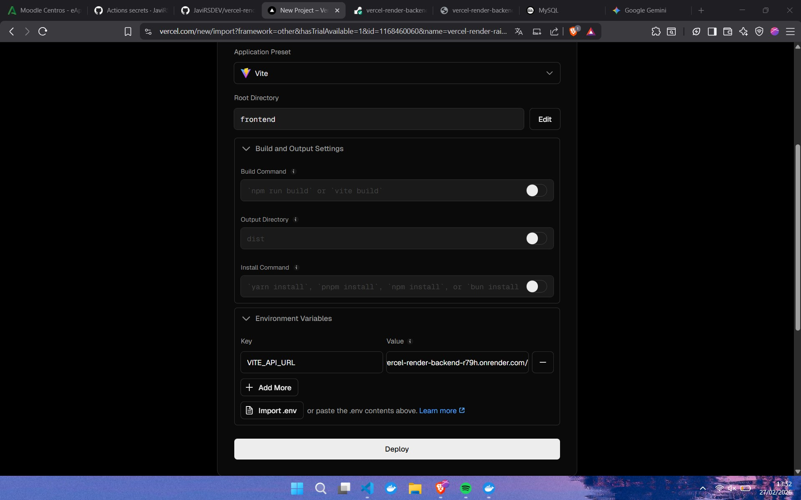
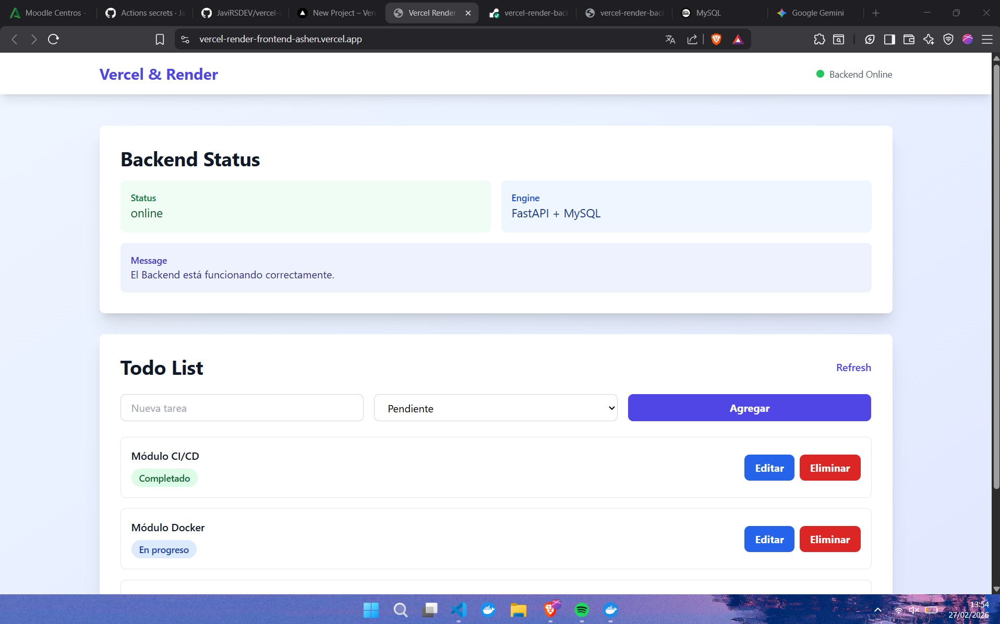
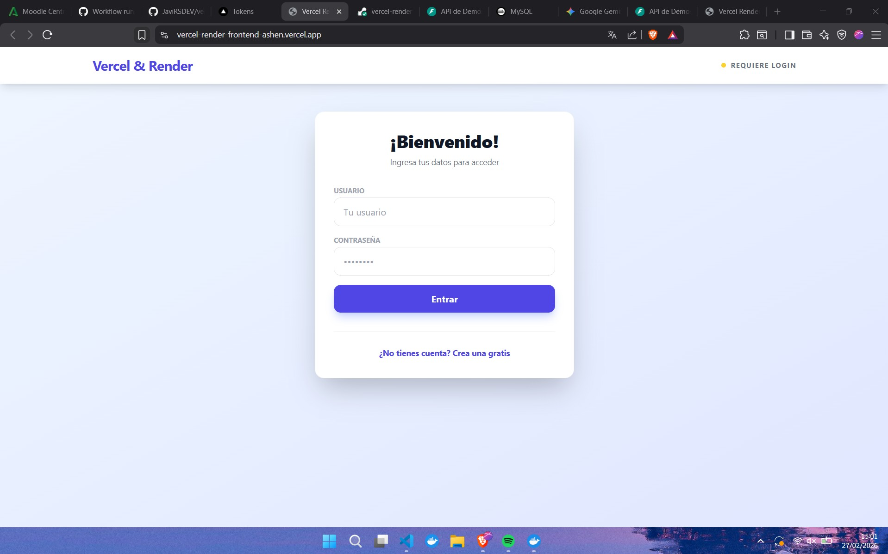
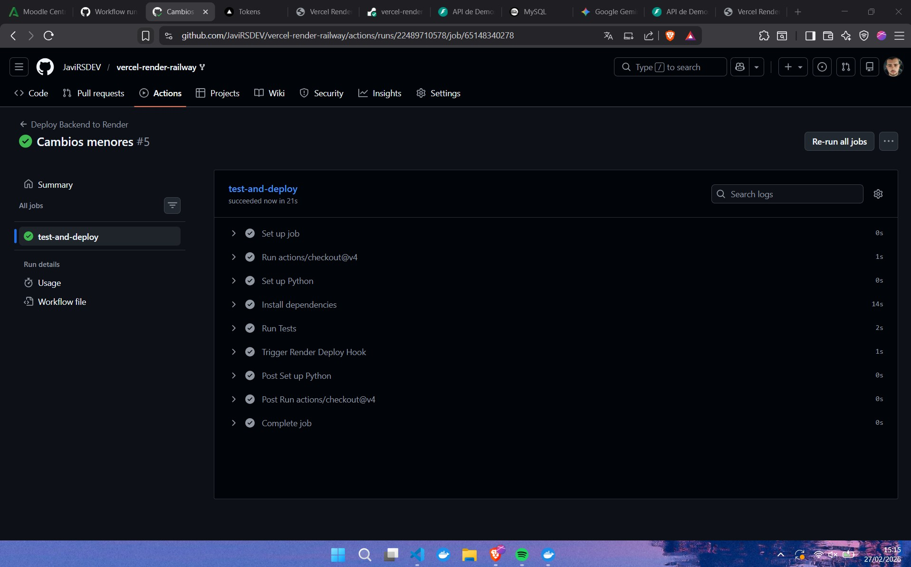
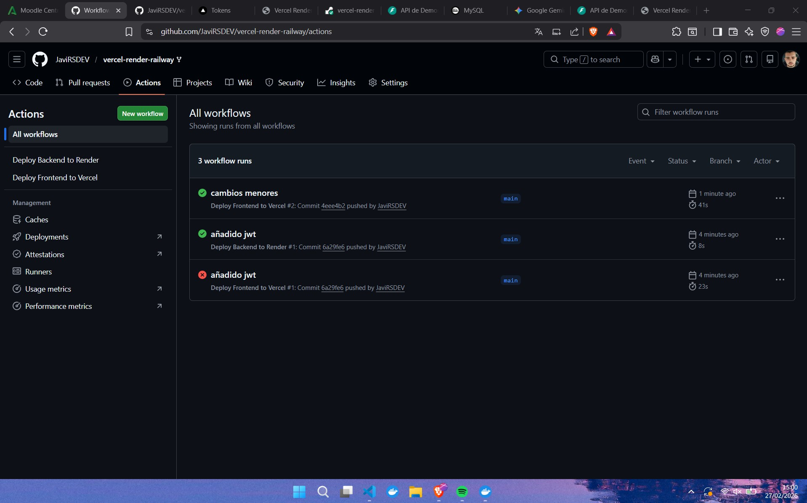

### Práctica final despliegue de aplicación propia en vercel, render y railway.

* **En render se deberá tener la siguiente configuración para su correcto despliegue**

Comprobamos que podemos acceder a la API tras desplegarlo

* **Tras esto también tendremos que crear la base de datos mysql en railway, una vez creada añadiremos el enlace de la misma como una variable de entorno dentro de render**

* **Finalmente deberemos de disponer de la siguiente configuración en vercel para el correcto despliegue del frontend, en este caso debemos usar el enlace que nos brinda render para poder conectar con éxito la API**

Comprobamos que la aplicación esta totalmente levantada tras el despliegue del frontend

## Backend: Autenticación Segura (JWT)

Se implementó un sistema de seguridad para proteger los endpoints de la API:

* **Modelos y Hashing:** Creación de la tabla `users` usando SQLAlchemy. Las contraseñas se encriptan antes de guardarse utilizando `passlib` y el algoritmo `bcrypt`.
* **Generación de Tokens:** Implementación del endpoint `/token` que valida las credenciales y devuelve un **JSON Web Token (JWT)** firmado.
* **Rutas Protegidas:** Uso de `OAuth2PasswordBearer` de FastAPI para exigir un token válido en las peticiones a los endpoints de negocio (ej. `/api/items`).

### Frontend: Integración y UX

* **Gestión de Estado UI:** Desarrollo de un componente de autenticación unificado que alterna fluidamente entre "Iniciar Sesión" y "Registro". Tras un registro exitoso, el sistema realiza login automático.
* **Interceptors de Axios:** Configuración de un interceptor global en `services/api.ts` que inyecta automáticamente el encabezado `Authorization: Bearer <token>` en todas las peticiones salientes si existe una sesión activa en el `localStorage`.

### Testing Automatizado (Pytest & Vitest)

Para garantizar la estabilidad del código frente a futuros cambios, se integraron varios tests:

* **Aislamiento de BD (Backend):** Configuración de Pytest para levantar una base de datos SQLite efímera en memoria. Se utilizaron *fixtures* (`autouse=True`) para crear y destruir las tablas antes y después de cada test.

### Integración y Despliegue Continuo (CI/CD)

Se automatizó todo el ciclo de vida del software mediante **GitHub Actions**, garantizando que el código roto nunca llegue a producción.

* **Pipeline de Backend (`backend.yml`):**
    1. Levanta un entorno Ubuntu y configura Python 3.11.
    2. Instala dependencias y ejecuta la suite de Pytest (`python -m pytest`).
    3. Si (y solo si) los tests pasan exitosamente (`if: success()`), dispara un Webhook hacia Render para actualizar la API.
* **Pipeline de Frontend (`frontend.yml`):**
    1. Ejecuta linters y pruebas de Vitest.
    2. Utiliza el Vercel CLI, autenticándose mediante *Secrets* de GitHub (`VERCEL_TOKEN`), para realizar el despliegue automático del frontend.

---
